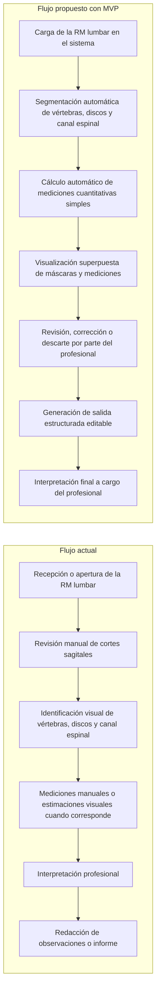

# Comparación entre flujo actual y flujo propuesto

## Introducción

La comparación entre el flujo actual de trabajo y el flujo propuesto con el MVP permite analizar si la incorporación de segmentación automática, mediciones cuantitativas simples y visualización asistida resulta compatible con la práctica profesional vinculada al análisis de resonancias magnéticas lumbares sagitales.

El objetivo de esta instancia de User Research no es validar un diagnóstico automático ni evaluar al sistema como reemplazo del criterio clínico. Por el contrario, busca indagar si la integración de estas funcionalidades puede aportar asistencia operativa dentro del flujo real de trabajo, manteniendo al profesional como responsable de la revisión, corrección, descarte e interpretación final de los resultados.

Esta comparación permite identificar tareas actualmente manuales o repetitivas, explorar oportunidades de apoyo mediante software, detectar riesgos percibidos por los usuarios y validar si el enfoque asistivo del MVP se ajusta a las necesidades y límites de la práctica profesional.

## Diagrama comparativo

## Tabla comparativa

| Etapa del trabajo | Flujo actual | Flujo propuesto con MVP | Valor esperado | Riesgo o punto a validar con usuarios |
|---|---|---|---|---|
| Identificación anatómica | El profesional identifica visualmente vértebras, discos intervertebrales y canal espinal durante la revisión de los cortes sagitales. | El sistema realiza una segmentación automática inicial de las estructuras anatómicas relevantes. | Reducir carga operativa inicial y ofrecer una base visual para la revisión profesional. | Validar si la segmentación es comprensible, útil y suficientemente clara para ser revisada sin generar confusión. |
| Mediciones | Las mediciones se realizan manualmente o se estiman visualmente cuando corresponde, según criterio y disponibilidad de herramientas. | El MVP calcula mediciones cuantitativas simples derivadas de las segmentaciones. | Aportar datos de apoyo consistentes y editables para complementar la evaluación profesional. | Validar que las mediciones sean pertinentes, interpretables y revisables antes de incorporarse a una salida estructurada. |
| Visualización de resultados | La revisión se basa principalmente en la imagen original y en la experiencia del profesional para reconocer estructuras y hallazgos. | El sistema muestra máscaras y mediciones superpuestas sobre la RM lumbar original. | Facilitar la inspección visual de estructuras segmentadas y la detección de posibles errores del sistema. | Evaluar si la superposición mejora la revisión o si puede interferir con la lectura de la imagen. |
| Revisión profesional | El profesional realiza la evaluación completa de manera manual y conserva el control del proceso interpretativo. | El profesional revisa, corrige o descarta los resultados generados por el sistema antes de utilizarlos. | Preservar el control humano directo y permitir que la automatización funcione como apoyo operativo. | Confirmar si el flujo de revisión resulta aceptable, eficiente y compatible con la práctica real. |
| Generación de salida/informe | Las observaciones o el informe se redactan manualmente a partir de la revisión del estudio. | El MVP genera una salida estructurada editable con resultados y mediciones revisadas. | Organizar la información obtenida y facilitar su edición posterior por parte del profesional. | Validar si la estructura propuesta se adapta a las necesidades de documentación y no condiciona indebidamente la interpretación. |
| Responsabilidad clínica | La interpretación y responsabilidad clínica recaen completamente en el profesional. | La interpretación final continúa a cargo del profesional; el sistema no emite diagnóstico autónomo. | Mantener una separación clara entre asistencia automatizada e interpretación clínica. | Verificar que los usuarios perciban adecuadamente el rol asistivo del sistema y sus límites. |

## Preguntas de validación

### Preguntas con escala de 1 a 5

Escala sugerida: 1 = Totalmente en desacuerdo, 5 = Totalmente de acuerdo.

1. ¿El flujo propuesto representa una mejora potencial respecto del flujo actual?
2. ¿La segmentación automática de estructuras anatómicas podría reducir carga operativa?
3. ¿Las mediciones cuantitativas automáticas serían útiles como apoyo, siempre que sean revisables?
4. ¿La visualización superpuesta facilitaría la revisión del estudio?
5. ¿La salida estructurada editable podría ayudar a organizar los hallazgos o resultados?
6. ¿El rol del profesional queda adecuadamente preservado en el flujo propuesto?
7. ¿Considera razonable que el sistema funcione como herramienta asistiva y no diagnóstica?

### Preguntas abiertas

1. ¿Qué parte del flujo actual considera más manual, repetitiva o demandante?
2. ¿En qué etapa confiaría más en una herramienta automática?
3. ¿En qué etapa mantendría sí o sí control humano directo?
4. ¿Qué información necesitaría ver para confiar en una segmentación o medición automática?
5. ¿Qué aspecto del flujo propuesto le genera mayor duda o riesgo?
6. ¿Qué modificaría del flujo propuesto para que se adapte mejor a la práctica profesional?

## Interpretación metodológica

Este instrumento permite contrastar el flujo de trabajo actual con un flujo asistido por software, centrado en la segmentación automática de estructuras anatómicas, la obtención de mediciones cuantitativas simples y la generación de una salida estructurada editable.

Desde el punto de vista metodológico, la comparación facilita la identificación de oportunidades de automatización en tareas operativas, sin desplazar la responsabilidad clínica del profesional. También permite relevar riesgos percibidos, condiciones necesarias para la confianza en los resultados, expectativas sobre la visualización de segmentaciones y requisitos para que la salida generada sea útil dentro de un contexto profesional.

Las respuestas obtenidas pueden utilizarse para priorizar funcionalidades del MVP, ajustar el flujo de revisión, definir criterios de aceptabilidad para la visualización y las mediciones, y reforzar la posición del sistema como herramienta asistiva. De este modo, el User Research contribuye a evaluar no solo la utilidad técnica del prototipo, sino también su adecuación al entorno real de uso y a los límites esperados por los profesionales.

## Versión breve para explicación oral

Antes de mostrar el diagrama, se puede introducir la comparación de la siguiente manera:

"En esta parte queremos comparar el flujo actual de trabajo con un flujo propuesto asistido por el MVP. La idea no es evaluar un sistema que diagnostique automáticamente ni reemplazar el criterio profesional, sino analizar si ciertas tareas operativas, como la segmentación de estructuras, la obtención de mediciones simples y la organización de una salida editable, podrían integrarse de manera útil al proceso de revisión de una resonancia lumbar. En el flujo propuesto, el profesional conserva el control: puede revisar, corregir o descartar los resultados generados por el sistema, y la interpretación final sigue estando a su cargo. Nos interesa conocer si esta forma de asistencia tiene sentido dentro de la práctica real, qué beneficios podría aportar y qué riesgos o limitaciones deberían validarse antes de avanzar."
